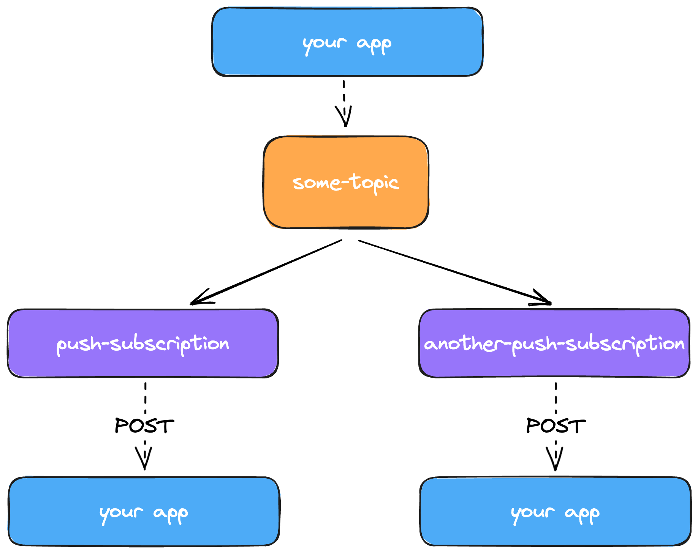

Subscriptions are the way [events](/concepts/events) are consumed across your application.

There are two types of subscription available, each with very different methods of using and use-cases.

## Push

A push subscription sends a `POST` request to a specific endpoint when it recieves an event, with the request body being the event data.

Sailhouse expects a `200 OK` response within 5 seconds of it being sent, otherwise it will count the attempt as failed and [retry](#retries)

### Retries

:::note[Future thing]
This will be customisable down the line
:::

Sailhouse will attempt to deliver an event every 5 minutes after the first failure up to 5 times. As soon as a `200 OK` is recieved, the event is counted as acknowledged.

If an event isn't acknowledged in this time frame, it is counted as a [dead letter](#dead-letters)

### Dead Letters

"Dead letters" are events that were failed to be delievered, and so are given a status which indicates the platform will not attempt to deliver them until user (ie, developer) intervention.

However, any _new_ events Sailhouse will attempt to deliver as usual.

When the upstream issue preventing processing of events has been fixed, you can clear the dead letters 1-by-1 or all at once, which will re-insert them into the queue for processing.

:::caution
Unlike new events, events from the dead letter queue will instantly be returned to the dead letter queue on failure, with no retries attempted.
:::

## Pull

Pull subscriptions require the consuming application to request the events ad-hoc. Think a billing cycle that runs every 6 hours, or an activity summariser that counts the number of actions within a week.

They allow you to build processing-heavy workflows that only consume new data extremely easily. Instead of having to perform a complex, expensive query on a database, you just pull all the new events through.

### Time Window

## Subscription Filters

Subscription filters is one of the developer-focused features of the platform.

When it comes to building an event-driven system, the decision of making a generic or narrow-scope topic can often have massive downstream impact on the simplicity of building new features.

If it's too generic, many consumers will recieve events they don't care about. If it's too narrow in scope, you'll have several events being sent as part of the same operation, making it hard to understand the flows and what triggers where.

Subscription filters allow you to keep your **topics generic**, while reducing noise and cost. You can instruct subscriptions to only care about certain events, dynamically. It keeps your code simple, and your costs down.

:::note[Future thing]
The full power of subscription filters lies beyond `key=value` pairs, and this will be something we expand on as the platform develops.
:::

### Filter Path

The filter path is the simple JSON path to the property you want to filter on.

| Event | Path|
| --- | --- |
| `user-created` | `user.type` |
| `order-created` | `order.address.country` |
| `application-updated` | `application.status` |

### Filter Value

The filter value is the value for a subscription to match on, following the examples above.

| Value | Example |
| --- | --- |
| `pro` | Create the customer on stripe and start their trial. |
| `UK` | For the UK, you may need to run extra logic for imports and taxes. |
| `rejected` | When an application is rejected, we should email the candidate. Not all updates need contact. |
