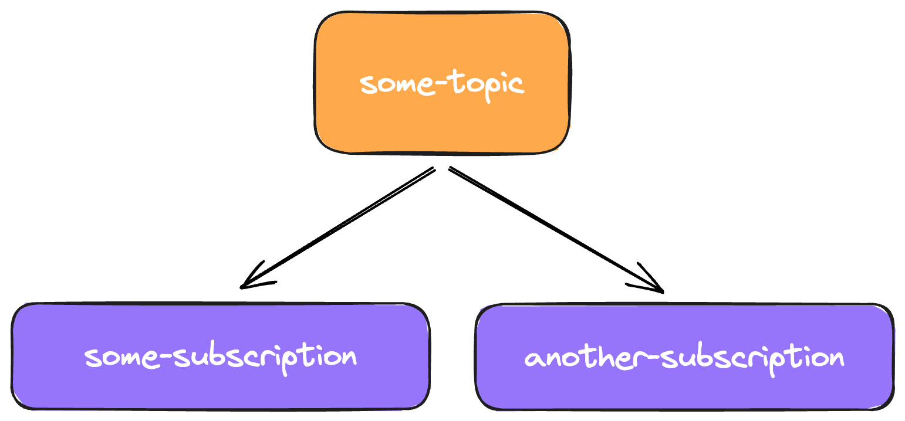

Topics are the logical "buckets" your [events](/concepts/events) are split into. They serve to indicate the different types of events you're sending, and act as the signpost for sending events to downstream [subscriptions](/concepts/subscriptions).



## Summary

A topic, identified by it's `slug`, is the destination you send events to. Subscriptions are then attached to a topic, and consume the events that their given topic has recieved.

When sending an event, you send it to a single specific topic.

```ts
client.publish('topic-slug', event)
```

The topic then distributes the event to all the child subscriptions for consumption in your application.
